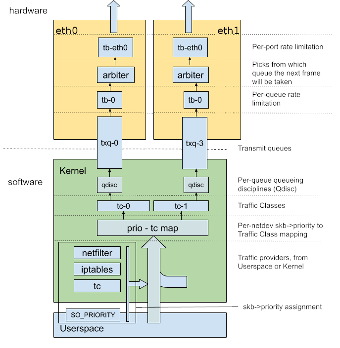

<h1 align="center">Traffic Control Packet Leakage</h1>


<div align="center"></div>

### eBPF-based Egress Packet Redirection with Traffic Control (TC).

- You can try with your own data builded from raw netflow.
- Fork this project to your Github account.
- This software is created under [MIT License](https://github.com/MuriloChianfa/tc-leakage/blob/main/LICENSE)

## Table of Contents

- [Introduction](#introduction)
- [Features](#features)
- [Prerequisites](#prerequisites)
- [Installation](#installation)
  - [1. Clone the Repository](#1-clone-the-repository)
  - [2. Compile the eBPF Program](#2-compile-the-ebpf-object-and-go-program)
  - [3. Load and Attach eBPF Programs](#3-load-and-attach-the-ebpf-object-into-your-nic)
- [How It Works](#how-it-works)
  - [Traffic Control Overview](#traffic-control-overview)
  - [eBPF Integration with tc](#ebpf-integration-with-tc)
- [Usage](#usage)
  - [1. Checking and Retrieving TGID and PID eBPF Maps](#checking-and-retrieving-tgid-and-pid-ebpf-maps)
  - [2. How to try and test](#how-to-try-and-test)
  - [3. eBPF Kernel Tracing Pipe](#ebpf-kernel-tracing-pipe)
- [Troubleshooting](#troubleshooting)
- [Contributing](#contributing)
- [Acknowledgments](#acknowledgments)

## Introduction

Welcome to the **eBPF-based Egress Packet Redirection with Traffic Control (TC)** project! This project leverages the power of **eBPF** (Extended Berkeley Packet Filter) and **Traffic Control** to dynamically redirect egress network packets from specific processes to designated network interfaces.

> [!IMPORTANT]
>
> This repository is created **solely for educational purposes**. The content provided here is intended to serve as examples and study material. **There are no guarantees that the code or any other material is suitable or safe for production use**.
>
> If you choose to use any part of this project in a production environment, **you do so at your own risk**. It is strongly recommended to thoroughly review the code and implement proper testing before any production use.

## Features

- **Process-Based Packet Redirection:** Redirect packets based on the Proccess ID (PID) or Thread Group ID (TGID) of your processes based of your choices.
- **Multi-Threaded Application Support:** Effectively handles multi-threaded applications like Google Chrome, ensuring all threads' traffic is correctly managed.
- **Minimal Overhead:** Efficient eBPF programs ensure high-performance packet processing with minimal latency.

## Prerequisites

Before you begin, ensure you have the following installed on your system:

- **Operating System:** Linux kernel version **5.8** or higher (for comprehensive eBPF and TC support).
- **Compiler:** `clang` and `llvm` (version 10 or higher).
- **Langs:** `golang` (version 1.23 or higher).
- **BPF Tools:** `bpftool`.
- **Libraries:** `libbpf`.

### Installing Dependencies

```bash
sudo apt update
sudo apt install -y clang llvm libbpf-dev libelf-dev make
```

## Installation

### 1. Clone the Repository

```bash
git clone git@github.com:MuriloChianfa/tc-leakage.git
cd tc-leakage
```

### 2. Compile the eBPF object and Go program

```bash
clang -O2 -g -target bpf -Wextra -I./bpf/ -I/usr/include/bpf -c bpf/leakage.c -o bpf/leakage.o
go build -C cmd -o ../tc-leakage
```
or simple runnning:
```bash
make
```

### 3. Load and Attach the eBPF object into your NIC

```bash
# Remember to change enp2s0 to your default routing interface
sudo tc qdisc add dev enp2s0 clsact
sudo tc filter add dev enp2s0 egress bpf da obj bpf/leakage.o sec tc_egress
```
or simple runnning:
```bash
make load
```

## How It Works

### Traffic Control Overview

**TC** is a component of the Linux kernel networking stack that provides mechanisms for controlling the flow of network traffic. It allows administrators to define **queueing disciplines (qdiscs)** and filters to manage packet scheduling, prioritization, and manipulation.

In this project, tc is used to attach an eBPF program to the **egress** (and only egress) path of a network interface. This eBPF program intercepts outgoing packets, performs actions like redirection and source IP modification based on process-specific mappings.

### eBPF Integration with tc

**eBPF (Extended Berkeley Packet Filter)** is a powerful technology that allows for running sandboxed programs within the Linux kernel. By integrating eBPF with `tc`, we can perform high-performance, low-latency packet processing directly within the kernel space.

Here's how they interact in this project:

1) **eBPF Program Attachment**:

    - The eBPF program (leakage_tc.o) is attached to the egress path of a specified network interface (e.g., eth0) using tc.

2) **Packet Interception**:

    - As packets exit the network interface, they pass through the eBPF program.

3) **Packet Processing**:

    - The eBPF program determines if the packet should be redirected based on the TGID-to-ifindex mapping.
    If a match is found, it modifies the packet's source IP address and redirects it to the target interface.

## Usage

```bash
Usage:
  tc-leakage load --iface <iface>
      Loads & attaches the eBPF XDP program to <iface> and pins the map.

  tc-leakage set --pid <pid> --redir <iface>
      Updates the pinned map with (PID -> ifindex) so packets from <pid> redirect to <iface>.

Examples:
  sudo ./tc-leakage load --iface enp2s0
  sudo ./tc-leakage set --pid 29799 --redir ppp0
```

### Checking and Retrieving TGID and PID eBPF Maps

To redirect packets from a specific process, map its TGID to the desired network interface's ifindex:

```bash
# Identify the PID of the target process (e.g., ping)
pidof chrome

# Identify the TGID of the target process (e.g., Google Chrome)
pgrep -x chrome
```

Populate Interface IP Map:

```bash
# Replace ppp0 by your target interface
pidof chrome | xargs -I {} sudo ./tc-leakage set --pid {} --redir ppp0
```

## How to try and test

Generate some traffic to debug, like doing some pings:

```bash
nogup ping 8.8.8.8 &
sudo ./tc-leakage set --pid `pidof ping` --redir ppp0
```

To view the logs or if they're being redirected:

```bash
sudo cat /sys/kernel/debug/tracing/trace_pipe
sudo tcpdump -pni any dst 8.8.8.8
```

Example of the output logs:

> Before load eBPF program

<small>
enp2s0 Out IP 192.168.0.10 > 8.8.8.8: ICMP echo request, id 65392, seq 4, length 64
</small>
</br>
<small>
enp2s0 Out IP 192.168.0.10 > 8.8.8.8: ICMP echo request, id 65392, seq 4, length 64
</small>
</br>

> After load eBPF program

<small>
ppp0 Out IP 100.64.0.10 > 8.8.8.8: ICMP echo request, id 65392, seq 4, length 64
</small>
</br>
<small>
ppp0 Out IP 100.64.0.10 > 8.8.8.8: ICMP echo request, id 65392, seq 4, length 64
</small>

## eBPF Kernel Tracing Pipe

<small>
ping-131285  [05] b..4. 59.43: bpf_trace_printk: TC Redirect: Found ifindex 9 for PID 131285</small>
<br>
<small>ping-131285  [05] b..4. 59.43: bpf_trace_printk: TC Redirect: Found ifindex 9 for PID 131285</small>
<br>
<small>Compositor [05] b.s2. 59.64: bpf_trace_printk: TC Pass: No mapping found for PID or TGID 128</small>
<br>
<small>Thread-128  [00] b..1. 59.19: bpf_trace_printk: TC Pass: No mapping found for PID or TGID 1028</small>
<br>
<small>Thread-128  [01] b..1. 59.79: bpf_trace_printk: TC Pass: No mapping found for PID or TGID 1028</small>
<br>
<small>Media#132  [05] b.s2. 59.70: bpf_trace_printk: TC Pass: No mapping found for PID or TGID 1302</small>
<br>
<small>Thread-128  [00] b..1. 59.33: bpf_trace_printk: TC Pass: No mapping found for PID or TGID 1028</small>

## Troubleshooting

> [!IMPORTANT]
>
> - **eBPF Program Compilation Errors:** Ensure all necessary libraries was installed, some kernel may need to you generate a new vmlinuz header file!
> - **Permissions Issues:** As you loading new programs directly into Linux Kernel, you must need to run some commands with `root` privileges.

## Contributions

We welcome contributions! Feel free to open issues for suggestions or bug
reports, and pull requests are highly appreciated.

## Acknowledgments

- **eBPF Community:** For their continuous efforts in advancing eBPF capabilities.
- **Linux Kernel Developers:** For maintaining and enhancing the kernel's networking stack.
- **Open-Source Contributors:** For providing tools like bpftool who helps eBPF development.
