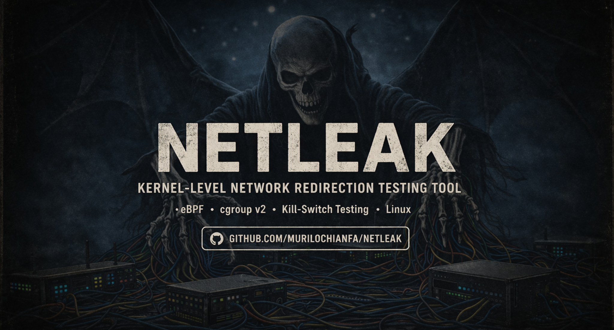

</img>

<p align="center">
  <a href="https://github.com/MuriloChianfa/netleak/releases/latest"></a>
  <a href="https://github.com/MuriloChianfa/netleak/actions/workflows/build.yml"></a>
  <a href="https://github.com/MuriloChianfa/netleak/actions/workflows/e2e.yml"></a>
  <a href="https://github.com/MuriloChianfa/netleak/blob/main/LICENSE"></a>
  
  
</p>

<p align="center">
  
  
  
  
</p>

<p>
  A kernel-level, proxychains-like tool for per-process traffic redirection on Linux. Built on top of <strong>cgroup v2</strong> and <strong>eBPF</strong>, netleak forces all network traffic from a process and its entire child tree through a specific network interface, completely transparently to the application. A kernel-enforced <strong>kill-switch</strong> drops every packet instead of falling back to the default route, guaranteeing zero traffic leakage under any failure conditions.
</p>

## Install from Package

<details name="install" open>
  <summary style="font-size: 16px;"><strong>Ubuntu/Debian</strong></summary>

  Download the `.deb` package from the [latest release](https://github.com/MuriloChianfa/netleak/releases/latest) and install it:

  ```bash
  curl -LO https://github.com/MuriloChianfa/netleak/releases/download/v1.1.0/netleak_1.1.0_amd64.deb
  sudo dpkg -i netleak_1.1.0_amd64.deb
  ```
</details>
<details name="install">
  <summary style="font-size: 16px;"><strong>Fedora/RHEL/Rocky/AlmaLinux</strong></summary>

  Download the `.rpm` package from the [latest release](https://github.com/MuriloChianfa/netleak/releases/latest) and install it:

  ```bash
  curl -LO https://github.com/MuriloChianfa/netleak/releases/download/v1.1.0/netleak-1.1.0-1.x86_64.rpm
  sudo rpm -i netleak-1.1.0-1.x86_64.rpm
  ```
</details>

## Or Build & Install from Source

<details name="build-source">
  <summary style="font-size: 16px;"><strong>Ubuntu/Debian</strong></summary>

  ```bash
  # Install build dependencies
  sudo apt update
  sudo apt install -y clang llvm libbpf-dev libelf-dev make golang

  # Clone and build
  git clone https://github.com/MuriloChianfa/netleak.git
  cd netleak
  make
  ```
</details>
<details name="build-source">
  <summary style="font-size: 16px;"><strong>Fedora/RHEL/Rocky Linux</strong></summary>

  ```bash
  # Install build dependencies
  sudo dnf install -y clang llvm libbpf-devel elfutils-libelf-devel make golang

  # Clone and build
  git clone https://github.com/MuriloChianfa/netleak.git
  cd netleak
  make
  ```
</details>

## Usage

```
sudo netleak <interface> <command> [args...]
```

### Examples

Route curl through a specific interface:

```bash
sudo netleak ppp0 curl ifconfig.me
```

Run a shell with all traffic going through a given interface:

```bash
sudo netleak wg0 bash
```

> [!IMPORTANT]
>
> Everything launched from that shell (and its children*), will have traffic routed through `wg0`.

## Security

For details on reporting vulnerabilities and our security practices, see the [Security Policy](https://github.com/MuriloChianfa/netleak/security/policy).

## License

The eBPF/C source code is licensed under GPL-3.0-only ([LICENSE-GPL](LICENSE-GPL)).

The Go source code is licensed under MIT ([LICENSE](LICENSE)).
