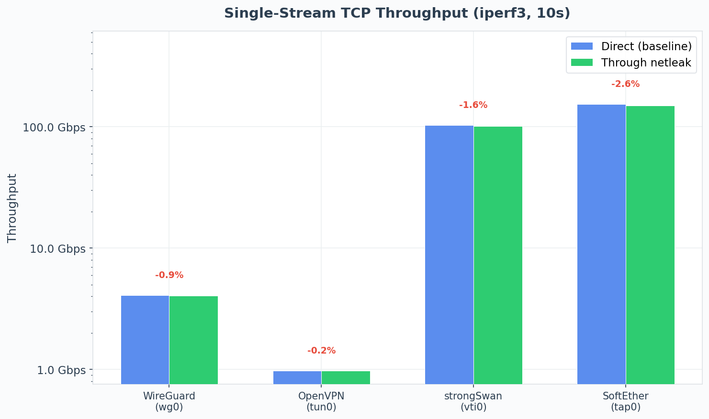
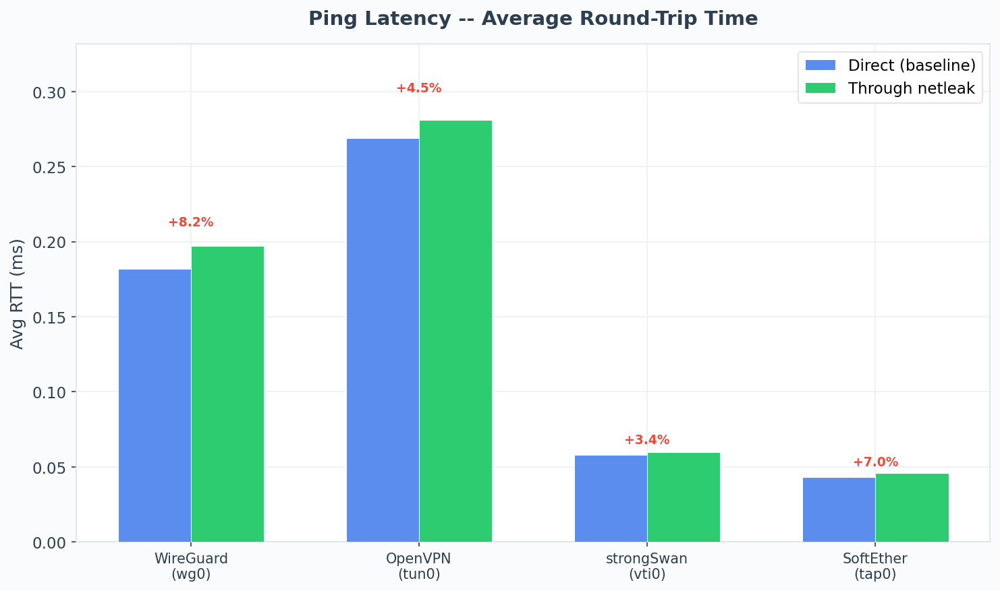

# E2E Tests & VPN Throughput Benchmarks

## Benchmark Results

All measurements taken inside QEMU/KVM VMs (2 vCPUs, 2 GB RAM, Alpine Linux 3.21). Each benchmark runs `iperf3` for 10 seconds over the VPN tunnel, comparing direct throughput against traffic routed through netleak.

<p align="center">
  
  
</p>

## Running Benchmarks

```bash
# Run all VPN benchmarks (WireGuard, OpenVPN, strongSwan, SoftEther)
make bench

# Run a single scenario
make bench-wireguard

# Regenerate charts from existing results
make -C tests/e2e charts
```

### Regression Detection

The aggregator compares current results against `tests/e2e/baseline.json`. To update the baseline after a known-good run:

```bash
cp tests/e2e/results/results.json tests/e2e/baseline.json
```

## E2E Functional Tests

Functional VPN tests verify routing, kill-switch, and recovery behavior:

```bash
# Run all e2e scenarios
make e2e

# Run a single scenario
make e2e-wireguard
```

Each scenario boots a QEMU VM, provisions a VPN tunnel via Ansible, and verifies that `netleak <iface> curl ...` routes traffic correctly, the kill-switch activates when the interface goes down, and traffic recovers when it comes back up.
